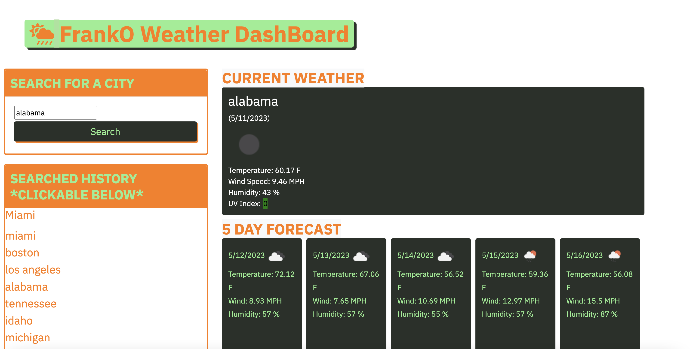

In this project, I will build a weather dashboard for the user who wants the weather outlook for multiple cities so he or she can plan the trip accordingly. It will feature the temperature , humidity , and the wind speed.

The project is structured with assets folder, index.html, README.md and script.js. Within the assets folder, there are also images folder and css folder.There is a style.css file inside of the folder.The image folder may contain images for this weather dashboard.

Live URL via github pages: https://franko88bit.github.io/FrankO-Weather-API-Dashboard/

Screenshot of Franko Weather Dashboard:
